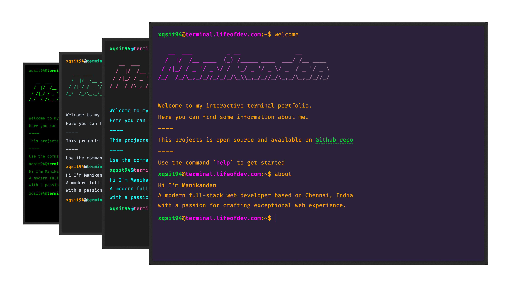

# Terminal Portfolio by xQsit94

My personal portfolio, built with Vue 3, TypeScript and TailwindCSS.


## Features
- Autocompletion
- Command history
- Multiple themes
- PWA support

## Tech Stack
- Vue 3
- TypeScript
- TailwindCSS
- Pinia
- Github Actions (CI/CD)

## Multiple Themes
The terminal supports multiple themes. You can change the theme by typing `themes set <theme-name>`.
To see all available themes, type `themes` in terminal.


## Run Locally
Clone the project
```bash
  git clone https://github.com/xqsit94/terminal-portfolio.git
```

Go to the project directory
```bash
  cd terminal-portfolio
```

Install dependencies
```bash
  bun install
```

Start the server
```bash
  bun run dev
```

## Inspiration
- [satnaing/terminal-portfolio](https://github.com/satnaing/terminal-portfolio)

## License
[MIT](LICENSE)

## Author
[@xQsit94](https://github.com/xQsit94)
